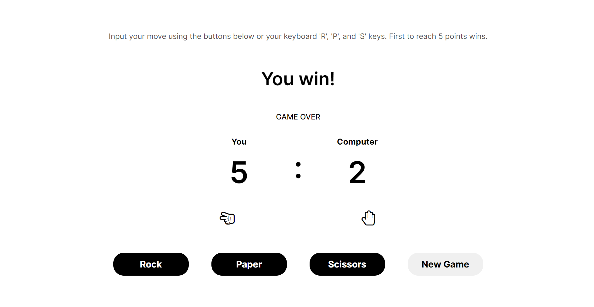

## Rock Paper Scisors
The Odin Project - Foundations Course Project 3:

Developing a Rock Paper Scissors game using Javascript for DOM manipulation + logic and HTML/CSS for UI.

## Preview

## Links
Live Link: https://luciavu.github.io/rock-paper-scissors/

Assignment: https://www.theodinproject.com/lessons/foundations-revisiting-rock-paper-scissors

## Credits
Icons from Fontello: https://fontello.com/ 